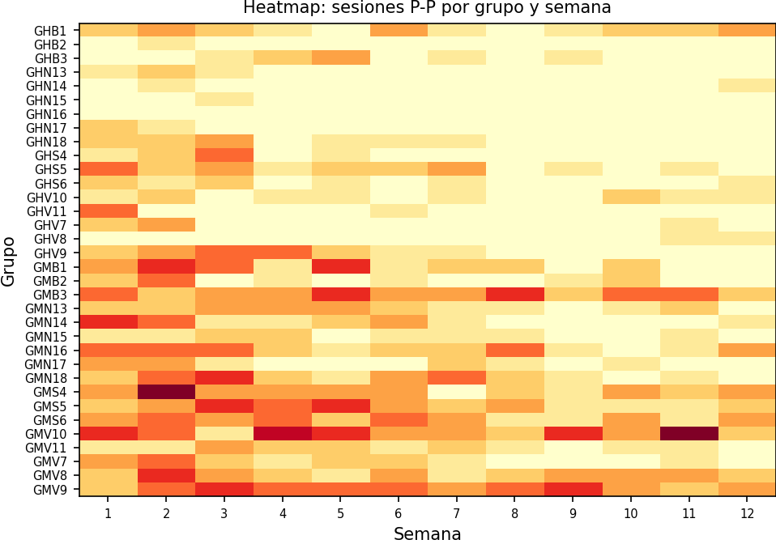
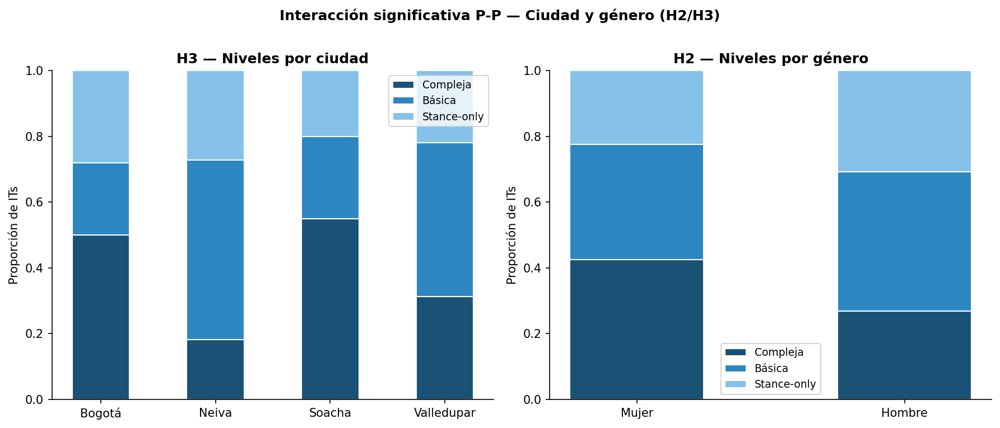

# Framework LLM para análisis de grupos de WhatsApp

Pipeline de análisis de mensajes de WhatsApp de programas sociales usando
Large Language Models (LLMs). Diseñado por IPA Colombia para ser replicable:
un nuevo proyecto solo necesita editar `config.yaml`.

**Implementación de referencia:** [Programa Apapáchar](#el-programa-apapáchar-implementación-de-referencia) — IPA Colombia, 2025–2026.

**Para usar este pipeline con tu proyecto:** lee primero
[la guía de adaptación de `config.yaml`](documentation/Process/modificacion_config.md)
— explica campo por campo qué cambiar para que el pipeline funcione con
tus datos sin tocar ningún script Python.

> [!IMPORTANT]
> Antes de usar este pipeline, asegúrate de que tus datos no contengan
> información personalmente identificable (PII). Los datos de participantes
> deben estar anonimizados antes de procesarse con cualquier herramienta de IA.
> Consulta las [IPA AI Usage Guidelines](https://ipastorage.box.com/s/mvr67ygvz1y3v8qmgjey67lk7msmyeks)
> si tienes dudas sobre la clasificación de tus datos.

---

## ¿Para quién funciona este pipeline?

Este framework es útil si tu proyecto cumple con estas condiciones:

### Tipo de intervención

- Tu programa implementó grupos de WhatsApp como canal de comunicación
  con participantes (intervenciones digitales, híbridas o presenciales
  con seguimiento digital)
- O tienes grupos focales digitales conducidos por WhatsApp

### Tipo de datos

- Tienes los mensajes exportados de esos grupos (en cualquier formato
  que puedas limpiar con Stata: `.dta`, `.csv`, `.xlsx`)
- Los datos pueden ser **longitudinales** (grupos con múltiples sesiones
  o semanas) o de **corte transversal** (una sola ronda de grupos)
- Los mensajes ya fueron o pueden ser anonimizados antes del análisis

### Contexto

- El programa tiene un componente de facilitación: hay alguien que guía
  los grupos y participantes que responden e interactúan
- Tienes interés en entender no solo *qué* se dijo, sino *cómo*
  interactuaron los participantes entre sí

Si tu proyecto encaja en este perfil, el único paso de configuración
es editar `config.yaml` con los nombres de columnas y parámetros de tu
dataset. No se necesita modificar ningún script Python.

---

## Índice

1. [¿Qué hace este pipeline?](#qué-hace-este-pipeline)
2. [Prerequisitos](#prerequisitos)
3. [Prueba rápida con datos de demo](#prueba-rápida-con-datos-de-demo)
4. [Inicio rápido](#inicio-rápido)
5. [El Programa Apapáchar (implementación de referencia)](#el-programa-apapáchar-implementación-de-referencia)
6. [Pipeline completo paso a paso](#pipeline-completo-paso-a-paso)
7. [Adaptar a un nuevo proyecto](#adaptar-a-un-nuevo-proyecto)
8. [Estructura del repositorio](#estructura-del-repositorio)
9. [Configuración del entorno](#configuración-del-entorno)
10. [Referencias](#referencias)

---

## ¿Qué hace este pipeline?

Toma los mensajes de WhatsApp de un programa social (ya limpios de PII) y
produce:

- **Clustering temático** para identificar temas recurrentes (KMeans + UMAP)
- **Mapa de similitud semántica** entre sesiones para ver la evolución temática
- **Buscador de citas** por código cualitativo (búsqueda vectorial local)
- **Indicadores de interacción participante-participante** (cadenas de diálogo,
  latencia de respuesta, retención, escalabilidad)
- **Excels estructurados para codificación DEDIOS** (Dedios-Sanguineti et al., 2025):
  el paso 10b selecciona los grupos más representativos; la codificación se realiza
  directamente con Claude Code sin necesidad de API key

El pipeline es **100% local** — embeddings con sentence-transformers, vectorstore con
ChromaDB. Combina **Stata** (limpieza y remoción de PII) con **Python** (análisis). La
codificación cualitativa con Claude se realiza en conversación directa con Claude Code.

---

## Prerequisitos

Antes de correr cualquier paso:

| Requisito | Para qué | Cómo instalar |
| --- | --- | --- |
| Python 3.12+ | Todo el pipeline Python | [python.org](https://www.python.org/downloads/) |
| `uv` | Gestor de entorno y dependencias | `pip install uv` |
| Claude Code | Codificación DEDIOS (conversacional) | Plan Claude Enterprise de tu organización |
| Stata 17+ | Solo paso 0 (remoción de PII) | Licencia institucional |

Los pasos 1–10f son 100% Python. Stata **solo es necesario** si tu dataset
aún contiene PII (paso 0).

---

## Prueba rápida con datos de demo

El repositorio incluye un dataset de **mensajes ficticios** (`DatosEjemplos-FalsePII.dta`,
143 mensajes) para verificar que el pipeline funciona antes de usar datos reales.

### 1. Instalar dependencias

```bash
git clone <url-del-repo>
cd LLM-Apapachar
uv sync
```

### 2. Verificar config.yaml

El repositorio ya apunta al dataset de demo por defecto:

```yaml
data:
  input:
    raw_stata_file: "data/raw/DatosEjemplos-FalsePII.dta"   # <-- demo incluido
```

No se necesita cambiar nada para la prueba.

### 3. Correr el pipeline

```bash
cd scripts/python_scripts

uv run python 02_preprocessing.py    # limpieza de texto
uv run python 03_chunking.py         # agrupar mensajes
uv run python 04_embeddings.py       # generar vectores (descarga modelo ~400 MB la primera vez)
uv run python 05a_clustering.py      # clustering temático (KMeans + UMAP)
uv run python 06_similarity_map.py   # mapa de similitud semántica
```

**Outputs esperados:**

```text
outputs/figures/05a_elbow.png             — número óptimo de clusters
outputs/figures/05a_umap_clusters.png     — visualización UMAP de clusters
outputs/figures/06_similarity_heatmap.png — mapa de calor semántico
outputs/figures/06_semantic_evolution.png — evolución semántica por semana
outputs/tables/06_similarity_matrix.csv  — matriz de similitud entre chunks
```

> El pipeline mínimo **no requiere Stata**. Los datos de demo ya están limpios de PII.

---

## Inicio rápido

Para tu propio proyecto con datos reales:

```bash
# 1. Clonar y preparar entorno
git clone <url-del-repo>
cd LLM-Apapachar
uv sync

# 2. Configurar credenciales de Stata
echo "STATA_CMD=C:\Program Files\Stata18\StataSE-64.exe" > .env
echo "STATA_EDITION=se" >> .env

# 3. Editar config.yaml — ajustar nombres de columnas, ciudades, prompts
#    (ver sección "Adaptar a un nuevo proyecto")

# 4. Remover PII de los datos (requiere Stata)
just stata-script 01_remove_pii

# 5. Pipeline Python (desde scripts/python_scripts/)
uv run python 02_preprocessing.py
uv run python 03_chunking.py
uv run python 04_embeddings.py
uv run python 05a_clustering.py      # clustering temático (KMeans + UMAP)
uv run python 06_similarity_map.py   # mapa de similitud semántica
uv run python 08b_citation_finder_participantes.py   # buscador de citas por código cualitativo
uv run python 10a_cadenas_interaccion.py             # cadenas de interacción P-P

# 6. Codificación DEDIOS con Claude Code (sin API key)
#    - Dataset pequeño: compartir los chunks directamente con Claude Code
#    - Dataset grande: ejecutar 10b para seleccionar grupos representativos,
#      luego codificar en conversación con Claude Code
uv run python 10b_piloto_codificacion.py             # selecciona grupos más representativos → Excel
```

---

## El Programa Apapáchar (implementación de referencia)

### Descripción del programa

Apapáchar es un programa de crianza **gratuito e híbrido** (80% digital /
20% presencial) co-desarrollado por Fundación Apapacho, ICBF, Equimundo,
CINDE e IPA Colombia. Está dirigido a cuidadores de niñas y niños de 0 a
5 años en familias vulnerables en Colombia, con énfasis especial en
involucrar a padres y cuidadores hombres.

**Objetivo central:** prevenir la violencia intrafamiliar contra la niñez y
promover una crianza amorosa, sensible y corresponsable.

La intervención dura **12 semanas** organizadas en 4 niveles. El canal
principal son grupos de WhatsApp donde facilitadores y participantes
intercambian mensajes, reflexiones y actividades semanales.

**Sitios de implementación (2025):** Bogotá, Soacha, Neiva, Valledupar.

### Los datos de WhatsApp

Cada grupo de WhatsApp contiene:

- Un **facilitador** (guía del programa, empleado de ICBF u organización aliada)
- Entre 8 y 15 **participantes** (cuidadores/padres de familia)
- Mensajes durante 12 semanas (texto, imágenes, audio, video)

El dataset usado para el análisis contiene únicamente mensajes de **texto**
de participantes ya anonimizados (sin PII). La estructura del archivo
`.dta` después de limpiar con Stata es:

| Columna | Descripción | Ejemplo |
| --- | --- | --- |
| `tipo` | Tipo de mensaje | `"Mensaje en Texto"` |
| `texto` | Texto del mensaje | `"Hoy practiqué lo de ayer con mi hijo"` |
| `remitente` | Rol del remitente | `"Participante"` / `"Facilitador"` |
| `v_grupo` | ID único del grupo | `"GMB3"` |
| `city_grupo` | Ciudad + grupo | `"BogotaGM3"` |
| `n_week` | Semana del programa (1–12) | `4` |
| `datetime` | Fecha y hora del mensaje | `"2025-03-12 10:32:00"` |
| `tema` | Tema de la sesión | `"Crianza sin violencia"` |
| `id_f` | ID único del participante | `"GMB3_P01F"` |
| `sex_grupo` | Género del grupo | `"Mujer"` / `"Hombre"` |

### El análisis de Apapáchar

El análisis de Apapáchar se divide en dos grandes componentes:

#### Componente 1: Análisis LLM (scripts 01–09)

Analiza el contenido de los mensajes: calidad lingüística, temas
recurrentes, evolución semana a semana, y extracción de citas relevantes
para el análisis cualitativo.

| Script | Descripción |
| --- | --- |
| `01_quality_analysis.py` | Longitud, informalidad, legibilidad (Flesch-Kincaid) |
| `02_preprocessing.py` | Limpieza mínima, filtro a mensajes de texto |
| `03_chunking.py` | Agrupa por ciudad × semana |
| `04_embeddings.py` | Genera vectores semánticos (sentence-transformers, local) |
| `05a_clustering.py` | Clustering temático KMeans + UMAP |
| `05b_semantic_search.py` | Búsqueda semántica RAG interactiva |
| `06_similarity_map.py` | Mapa de similitud semántica entre chunks |
| `06b_similarity_map_participantes.py` | Mismo mapa, solo mensajes de participantes |
| `08_citation_finder.py` | Busca citas por código del árbol cualitativo |
| `08b_citation_finder_participantes.py` | Mismo buscador, solo participantes |
| `09_analisis_citas_participantes.py` | Análisis cuantitativo de citas encontradas |

#### Componente 2: Análisis de interacción participante-participante (scripts 10a–10f)

Cuantifica el nivel de interacción genuina entre participantes usando el
framework de Dedios-Sanguineti et al. (2025), adaptado al contexto de
crianza de Apapáchar.

| Script | Descripción |
| --- | --- |
| `10a_cadenas_interaccion.py` | Detecta cadenas de diálogo P-P; produce `10a_cadenas_sesion.csv` |
| `10b_piloto_codificacion.py` | Genera Excel de piloto de codificación manual (3 grupos) |
| `10c_codificacion.py` | Genera 6 Excels de codificación a escala (todos los chunks) |
| `10d_analisis_interaccion.py` | Analiza resultados de la codificación manual |
| `10e_escalabilidad.py` | Retención, engagement y escalabilidad por ciudad/género |
| `10f_monitoreo_inicio_semana.py` | Latencia de primera respuesta como predictor de engagement |

#### Indicadores de interacción (framework Dedios-Sanguineti et al., 2025)

El análisis de codificación manual clasifica cada sesión de interacción
según 8 indicadores:

| ID | Nivel | Indicador |
| --- | --- | --- |
| I1 | Stance-only | Emergencia de posturas |
| I2 | Interacción básica | Consenso |
| I3 | Interacción básica | Desacuerdo |
| I4 | Interacción básica | Cambio de posición |
| I5 | Interacción compleja | Construcción descriptiva de normalidad |
| I6 | Interacción compleja | Construcción moral colectiva |
| I7 | Interacción compleja | Identidades compartidas |
| I8 | Específico Apapáchar | Adopción de práctica reportada |

Los indicadores I1–I7 son del framework original; I8 es un indicador nuevo
propuesto para intervenciones de crianza (evidencia directa de
transferencia al hogar).

### Ejemplos de outputs (Apapáchar)

#### Heatmap de sesiones participante-participante por grupo (paso 10a)



#### Niveles de interacción DEDIOS por ciudad y género (paso 10d)



---

## Pipeline completo paso a paso

### Paso 0: Remoción de PII (Stata)

**Script:** `scripts/do_files/01_remove_pii.do`

Detecta y elimina mensajes con nombres propios u otra PII antes de
cualquier análisis. Implementa 9 patrones de expresiones regulares:

| Patrón | Ejemplo eliminado |
| --- | --- |
| `"Mi nombre es..."` | `"Mi nombre es Diego Quintero"` |
| `"Me llamo..."` | `"me llamo Salomé González"` |
| `"Soy Nombre Apellido"` | `"soy Jacobo Gutierrez"` |
| `"Soy Nombre"` (una sola palabra) | `"Hola soy Pepa"` |
| Negritas WhatsApp | `"soy *David Jacobo Polania*"` |
| Nombre al inicio del mensaje | `"Salome Gonzalez tengo 31 años..."` |
| `"Llamo Nombre Apellido"` | `"llamo Andrea Trujillo"` |
| Nombres en minúsculas | `"soy mariana"`, `"soy antonia romero"` |
| Nombres de terceros | `"mi hijo Lucas"`, `"mi bebé pepito"` |

Después de este paso, los datos se clasifican como **Internal** y pueden
procesarse con herramientas de IA.

Ver [`documentation/Process/Explicacion-ScriptLimpieza.md`](documentation/Process/Explicacion-ScriptLimpieza.md).

```bash
just stata-script 01_remove_pii
```

**Output:** `data/raw/full_base_WA_clean_NOPII.dta`

---

### Paso 1: Análisis de calidad

**Script:** `scripts/python_scripts/01_quality_analysis.py`

Antes de procesar los mensajes, es útil saber con qué tipo de datos se
está trabajando. Este paso calcula estadísticas básicas: ¿qué tan largos
son los mensajes en promedio? ¿qué tan informales son (abreviaturas,
errores ortográficos)? ¿hay diferencias entre lo que escriben
facilitadores y participantes?

Estos indicadores ayudan a calibrar expectativas sobre la calidad del
análisis y a detectar grupos con muy baja participación antes de
invertir tiempo en pasos posteriores.

```bash
uv run python scripts/python_scripts/01_quality_analysis.py
```

**Outputs:** `outputs/tables/01_quality_summary.csv`,
`outputs/figures/01_distribucion_longitud.png`,
`outputs/figures/01_mensajes_por_semana.png`,
`outputs/figures/01_flesch_kincaid.png`

---

### Paso 2: Preprocesamiento

**Script:** `scripts/python_scripts/02_preprocessing.py`

Normaliza los mensajes (elimina espacios extra, saltos de línea) y
filtra solo los mensajes de texto, descartando notificaciones de
sistema, mensajes eliminados y contenido multimedia que no puede
analizarse. El resultado se guarda en formato Parquet, que es
significativamente más rápido de leer que CSV o `.dta` para todos
los pasos posteriores.

```bash
uv run python scripts/python_scripts/02_preprocessing.py
```

**Input:** `data/raw/full_base_WA_clean_NOPII.dta`
**Output:** `data/clean/mensajes_preprocesados.parquet`

---

### Paso 3: Chunking

**Script:** `scripts/python_scripts/03_chunking.py`

Los modelos de embeddings trabajan mejor con bloques de texto que con
mensajes individuales (que suelen ser muy cortos para capturar
significado). Este paso agrupa todos los mensajes de una misma unidad
de análisis (por ejemplo, ciudad × semana) en un solo bloque de texto.

Esto es lo que permite hacer preguntas como: "¿de qué hablaron en el
Grupo A durante la semana 3, comparado con el Grupo B?" La estrategia
de agrupación se configura en `config.yaml` y puede adaptarse a datos
longitudinales (por grupo y semana) o transversales (solo por grupo).

```bash
uv run python scripts/python_scripts/03_chunking.py
```

**Input:** `data/clean/mensajes_preprocesados.parquet`
**Output:** `data/clean/chunks.parquet`

---

### Paso 4: Embeddings

**Script:** `scripts/python_scripts/04_embeddings.py`

Convierte cada bloque de texto en un vector numérico que captura su
significado semántico. La idea central es que dos bloques que hablan
de temas similares tendrán vectores parecidos, y dos que hablan de
temas distintos tendrán vectores muy diferentes. Este "mapa de
significados" es la base de todos los análisis posteriores (clustering,
similitud, búsqueda de citas).

El modelo (`paraphrase-multilingual-mpnet-base-v2`) corre completamente
en tu computador — no se envía ningún dato a servidores externos. La
descarga inicial es de ~400 MB y queda guardada localmente. Los
vectores se almacenan en ChromaDB, una base de datos vectorial local
que persiste en disco entre sesiones.

```bash
uv run python scripts/python_scripts/04_embeddings.py
```

**Input:** `data/clean/chunks.parquet`
**Output:** `data/vectorstore/` (ChromaDB persistente)

---

### Paso 5a: Clustering temático

**Script:** `scripts/python_scripts/05a_clustering.py`

Agrupa automáticamente las sesiones en temas similares sin necesidad
de definir los temas de antemano. El resultado es un mapa visual donde
cada punto es una sesión del programa y los puntos cercanos son
sesiones que trataron contenidos parecidos.

Es útil para responder preguntas como: ¿cuáles son los grandes ejes
temáticos que emergen de los grupos? ¿hay sesiones atípicas que se
alejan del resto? ¿los grupos de distintas ciudades convergen en temas
similares o divergen? El número de clusters se configura en
`config.yaml`.

```bash
uv run python scripts/python_scripts/05a_clustering.py
```

**Output:** `outputs/figures/05a_clusters_umap.png`,
`outputs/tables/05a_cluster_labels.csv`

---

### Paso 6: Mapas de similitud semántica

**Scripts:** `06_similarity_map.py`, `06b_similarity_map_participantes.py`

Calcula qué tan parecido es el contenido temático entre cada par de
sesiones y lo muestra como un mapa de calor. Permite responder:
¿las sesiones de distintos grupos tratan temas similares entre sí?
¿hay semanas donde el contenido cambia drásticamente respecto a la
anterior (saltos temáticos)?

Para datos longitudinales, genera también un segundo gráfico con la
trayectoria semántica semana a semana: ¿el programa mantiene
coherencia temática o hay semanas que rompen con el hilo? El script
`06b` replica el mismo análisis filtrando solo mensajes de
participantes, para separar su voz de la del facilitador.

```bash
uv run python scripts/python_scripts/06_similarity_map.py
uv run python scripts/python_scripts/06b_similarity_map_participantes.py
```

**Output:** `outputs/figures/06_similarity_map.png`,
`outputs/figures/06b_similarity_map_participantes.png`

---

### Paso 8: Buscador de citas por código cualitativo

> **Opcional** — este paso solo aplica si tu proyecto ya tiene un árbol
> de códigos cualitativos definido (familias y códigos temáticos). Si
> estás empezando el análisis cualitativo desde cero, puedes saltarlo.

**Scripts:** `08_citation_finder.py`, `08b_citation_finder_participantes.py`

Si ya tienes un marco de codificación cualitativa, este paso te ahorra
horas de búsqueda manual. Para cada código definido en `config.yaml`,
el script busca automáticamente en todos los mensajes los fragmentos
más semánticamente afines a ese código y los presenta como citas
candidatas para tu análisis.

En lugar de leer miles de mensajes para encontrar ejemplos de un tema
específico, obtienes una lista ordenada de los más relevantes. El
script `08b` hace la misma búsqueda filtrando solo mensajes de
participantes. Los resultados se exportan a Excel para facilitar la
revisión manual.

```bash
uv run python scripts/python_scripts/08_citation_finder.py
uv run python scripts/python_scripts/08b_citation_finder_participantes.py
```

**Output:** `outputs/tables/08_citas_por_codigo.xlsx`,
`outputs/tables/08b_citas_por_codigo_participantes.xlsx`

---

### Paso 9: Análisis de citas

> **Opcional** — requiere haber corrido el Paso 8.

**Script:** `scripts/python_scripts/09_analisis_citas_participantes.py`

Toma las citas encontradas en el paso anterior y produce estadísticas
sobre su distribución: ¿qué códigos concentran más citas? ¿hay
diferencias por género, ciudad o momento del programa? Esto ayuda a
priorizar qué secciones del informe cualitativo desarrollar con más
profundidad y a identificar dónde hay mayor riqueza de material para
cada categoría de análisis.

```bash
uv run python scripts/python_scripts/09_analisis_citas_participantes.py
```

---

### Paso 10a: Detección de cadenas de interacción P-P

**Script:** `scripts/python_scripts/10a_cadenas_interaccion.py`

Los grupos de WhatsApp de programas sociales tienden a un patrón donde
el facilitador escribe y los participantes responden individualmente,
sin interactuar entre sí. Este paso detecta los momentos donde sí
ocurre diálogo genuino entre participantes: secuencias donde al menos
dos personas distintas se responden dentro de una ventana de tiempo
(por defecto 60 minutos).

Cuantificar esta interacción es clave para evaluar si el programa está
generando comunidad y aprendizaje colectivo, no solo transmisión de
información del facilitador hacia los participantes. El output es el
dataset base que alimenta todos los pasos 10b–10f.

```bash
uv run python scripts/python_scripts/10a_cadenas_interaccion.py
```

**Output:** `outputs/tables/10a_cadenas_sesion.csv`,
`outputs/tables/10a_resumen_grupos.csv`,
`outputs/figures/10a_*.png`

---

### Paso 10b: Codificación DEDIOS con Claude Code

**Script:** `10b_piloto_codificacion.py`

Genera un Excel estructurado con los grupos más representativos del dataset
para codificar las interacciones según el framework de Dedios-Sanguineti
et al. (2025). La codificación se realiza **directamente con Claude Code**
— sin necesidad de API key.

**Flujo recomendado:**

| Tamaño del dataset | Flujo |
| --- | --- |
| Pequeño (pocos grupos) | Compartir los mensajes directamente con Claude Code y codificar en conversación |
| Grande (muchos grupos / semanas) | Correr `10b` para seleccionar los grupos más representativos → compartir el Excel con Claude Code |

```bash
uv run python scripts/python_scripts/10b_piloto_codificacion.py
```

Cada Excel contiene:

- **Guia_indicadores**: descripción y ejemplos de cada indicador I1–I8
- **GRUPO_sN**: mensajes del grupo con color-coding de sesiones P-P
- **Plantilla de codificación**: lista de interacciones para asignar indicadores

**Output:** `outputs/tables/10b_piloto_codificacion.xlsx`

---

### Paso 10c: Generación de Excels de codificación a escala

**Script:** `scripts/python_scripts/10c_codificacion.py`

Para programas con muchos grupos y semanas, codificar todo manualmente
sería inviable. Este paso genera los Excels estructurados para cada
bloque de análisis (chunks), tomando como base los grupos
representativos seleccionados en el paso 10b y las interacciones
identificadas con Claude Code.

Cada Excel incluye los mensajes con color-coding visual, las
interacciones pre-identificadas y la plantilla de codificación para
asignar los indicadores DEDIOS. El archivo `CHUNKS` dentro del script
se puebla con ayuda de Claude Code durante el análisis.

```bash
uv run python scripts/python_scripts/10c_codificacion.py
```

---

### Pasos 10d–10f: Análisis de resultados de interacción

```bash
uv run python scripts/python_scripts/10d_analisis_interaccion.py  # resultados de codificación
uv run python scripts/python_scripts/10e_escalabilidad.py         # retención y engagement
uv run python scripts/python_scripts/10f_monitoreo_inicio_semana.py  # latencia vs. engagement
```

- **10d**: Con la codificación DEDIOS ya realizada, produce las gráficas
  comparativas: ¿qué nivel de interacción predomina? ¿hay diferencias
  entre subgrupos (género, ciudad, semana del programa)?
- **10e**: Analiza la retención semana a semana (¿cuántos participantes
  siguen activos?), el engagement por grupo y si el programa es
  escalable sin perder calidad de interacción.
- **10f**: Examina si la rapidez con que los participantes responden al
  primer mensaje de cada semana predice qué tan rica será la
  interacción esa semana. Útil como indicador de monitoreo en tiempo
  real para facilitar intervenciones tempranas.

---

## Adaptar a un nuevo proyecto

Todo lo específico del proyecto está en **`config.yaml`** en la raíz.
Un nuevo proyecto solo necesita editar este archivo; ningún script necesita cambios.

### Datos longitudinales vs. transversales

El pipeline funciona con **ambos tipos de datos**:

- **Longitudinal** (datos en el tiempo, ej. Apapáchar): grupos de WhatsApp
  que interactúan durante múltiples semanas. La unidad de análisis es
  `ciudad × semana`.
- **Transversal** (una sola toma, ej. grupos focales, encuesta única): grupos
  que interactúan una sola vez sin estructura temporal. La unidad de análisis
  es el grupo completo.

El único parámetro que cambia es `data.chunking.groupby`:

```yaml
data:
  chunking:
    # Longitudinal — un chunk por ciudad × semana:
    groupby: ["city_grupo", "n_week"]

    # Transversal — un chunk por grupo de WhatsApp:
    # groupby: ["v_grupo"]
```

Los scripts de análisis temporal (10e retención, 10f latencia por semana)
solo aplican con datos longitudinales y se omiten automáticamente si el
`groupby` no incluye la columna de semana.

### Secciones a editar en config.yaml

Las secciones marcadas con `[ADAPTAR]` son las que debes revisar:

```yaml
# =============================================================================
# PROYECTO [ADAPTAR]
# =============================================================================
project:
  name: "Nombre de tu programa"
  duration_weeks: 12          # Semanas de duración (longitudinal) o 1 (transversal)
  cities:                     # Lista de sitios (igual que aparecen en los datos)
    - "Ciudad1"
    - "Ciudad2"

# =============================================================================
# DATOS [ADAPTAR]
# =============================================================================
data:
  input:
    raw_stata_file: "data/raw/tu_base.dta"
    coding_tree_file: "documentation/tu_arbol_de_codigos.xlsx"

  columns:                    # Nombres de columnas en tu .dta
    message_type: "tipo"
    message_text: "texto"
    sender: "remitente"
    city_group: "city_grupo"
    week_number: "n_week"     # No necesario para datos transversales
    group_id: "v_grupo"
    datetime: "datetime"
    theme: "tema"
    participant_id: "id_f"
    gender_group: "sex_grupo"

  chunking:
    groupby: ["city_grupo", "n_week"]   # Longitudinal
    # groupby: ["v_grupo"]              # Transversal

  values:                     # Valores que distinguen participantes de facilitadores
    text_message_type: "Mensaje en Texto"
    participant_sender: "Participante"
    facilitator_sender: "Facilitador"

# =============================================================================
# PROMPTS [ADAPTAR]
# =============================================================================
prompts:
  chunk_summary: |
    Eres un asistente del {project_name}...
    # Usar {ciudad} y {semana} para longitudinal, o las columnas del groupby
    # Los {marcadores} se reemplazan automáticamente en tiempo de ejecución
```

Las secciones **sin** `[ADAPTAR]` (parámetros técnicos de algoritmos,
ChromaDB, UMAP, clustering) pueden mantenerse como están.

Para adaptar el **framework de indicadores de interacción**, editar la
sección `coding.indicators` del `config.yaml`. Los scripts de codificación
(10b, 10c) construyen automáticamente la guía y las plantillas desde allí.

---

## Estructura del repositorio

```text
LLM-Apapachar/
├── config.yaml                      # Configuración central del proyecto [EDITAR]
├── .env                             # Credenciales (NO subir a GitHub)
├── pyproject.toml                   # Dependencias Python
├── Justfile                         # Comandos de desarrollo
│
├── scripts/
│   ├── do_files/
│   │   └── 01_remove_pii.do         # Remoción de PII (Stata)
│   └── python_scripts/
│       ├── config_loader.py         # Singleton que carga config.yaml
│       ├── 01_quality_analysis.py
│       ├── 02_preprocessing.py
│       ├── 03_chunking.py
│       ├── 04_embeddings.py
│       ├── 05a_clustering.py
│       ├── 05b_semantic_search.py
│       ├── 06_similarity_map.py
│       ├── 06b_similarity_map_participantes.py
│       ├── 08_citation_finder.py
│       ├── 08b_citation_finder_participantes.py
│       ├── 09_analisis_citas_participantes.py
│       ├── 10a_cadenas_interaccion.py
│       ├── 10b_piloto_codificacion.py
│       ├── 10c_codificacion.py
│       ├── 10d_analisis_interaccion.py
│       ├── 10e_escalabilidad.py
│       └── 10f_monitoreo_inicio_semana.py
│
├── data/
│   ├── raw/                         # Datos originales — NUNCA subir a GitHub
│   ├── clean/                       # Datos preprocesados (sin PII)
│   └── vectorstore/                 # ChromaDB (embeddings en disco)
│
├── outputs/
│   ├── figures/                     # Gráficas generadas
│   └── tables/                      # Tablas y CSVs generados
│
└── documentation/
    ├── PROYECTO.md                  # Descripción completa del Programa Apapáchar
    ├── llm-whatsapp-pipeline.md     # Diseño del pipeline
    └── Explicacion-ScriptLimpieza.md
```

---

## Configuración del entorno

### Prerrequisitos

- **Stata 17+** (para el script de remoción de PII)
- **Python 3.12+** con `uv` instalado
- **Claude Code** (para la codificación DEDIOS conversacional) — incluido en el plan Claude Enterprise de tu organización

### Instalación

```bash
# Instalar uv (si no está instalado)
pip install uv

# Crear entorno virtual e instalar dependencias
uv sync

# Activar el entorno (opcional — uv run lo hace automáticamente)
.venv/Scripts/activate.ps1   # Windows PowerShell
source .venv/bin/activate    # macOS/Linux
```

### Variables de entorno

Crear un archivo `.env` en la raíz del proyecto:

```bash
# Requerido para correr scripts de Stata desde Python
STATA_CMD=C:\Program Files\Stata18\StataSE-64.exe
STATA_EDITION=se

# El pipeline Python es 100% local — no requiere API key.
# La codificación DEDIOS se realiza en conversación directa con Claude Code.
```

### Comandos útiles

```bash
just help              # Lista todos los comandos disponibles
just stata-script 01_remove_pii  # Correr un script Stata específico
just lint-py           # Verificar calidad del código Python
just fmt-python        # Formatear código Python con ruff
```

---

## Referencias

- Dedios-Sanguineti, M. C. et al. (2025). Framework for coding
  peer-to-peer interaction in WhatsApp groups of social programs.
  *(referencia interna IPA Colombia)*
- Ferreira, A. A. et al. (2025). A comprehensive qualitative analysis of
  patient dialogue summarization using large language models applied to
  noisy, informal, non-English real-world data. *Scientific Reports*,
  15, 31660. <https://doi.org/10.1038/s41598-025-13560-9>
- Cuartas, J. et al. (2022). The Apapacho Violence Prevention Parenting
  Program: Conceptual Foundations and Pathways to Scale. *Int J Environ
  Res Public Health*, 19(14), 8582.
